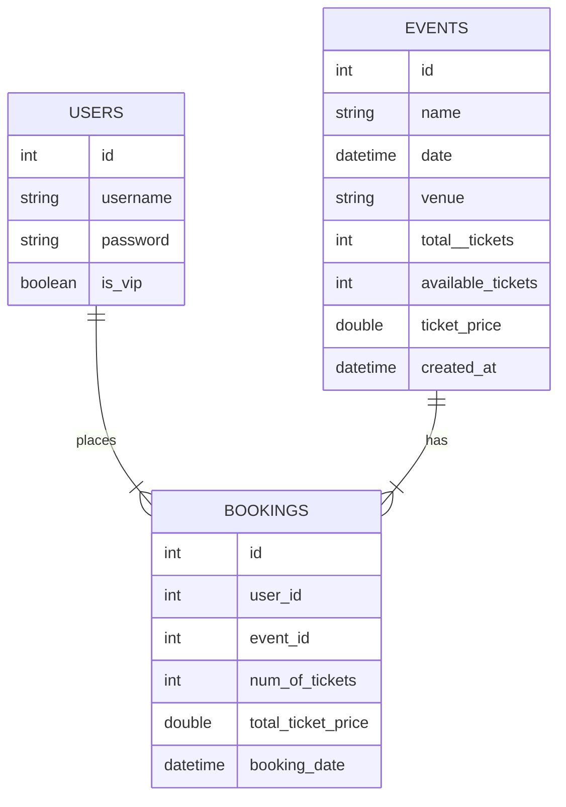

> _As an event organizer, I want to create events, so that people can book tickets for them._

- API `POST /events`
  - body:`{name, date, venue, totalTickets, ticketPrice}`.

> _As a customer, I want to view a list of available events, so that I can choose which one to attend._

- API `GET /events`
  - fetch `{name, date, venue, availableTicket}`.
- Authentication: IF `is_vip` == false, do not display VIP tickets for the first 24 hours. `created_at` as key property.

> _As a customer, I want to book tickets for an event, so that I can attend it._

- API `POST /bookings`
  - body: `{eventId, numOfTickets}`.

> _As a customer, I want to view the details of my ticket booking, so that I can confirm my booking information (event, number of tickets, and total cost)._

- API `GET /bookings`
  - fetch: `{event, numOfTickets, totalPrice}`.

> _As a customer, I want to cancel my ticket booking, so that I can get a refund and make my tickets available to others._

- API `DELETE /bookings/:id`
  - path_params: `bookingId`

